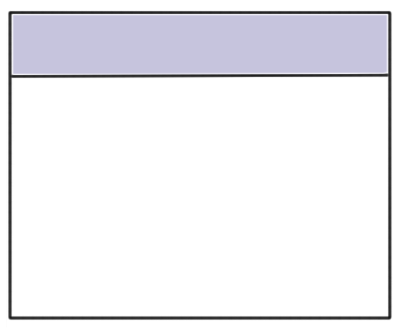
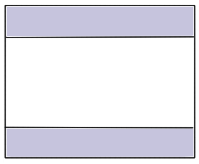
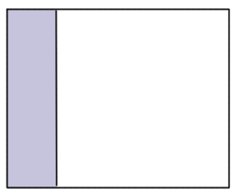
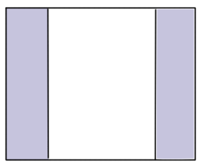
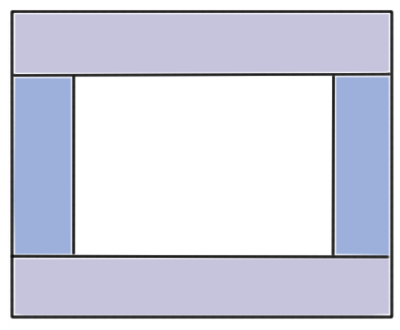




## Application 생성하기
```javascript
X.App({
	ready: function(){
		//application init
	}
});
```


## X.View
x-ui의 가장 핵심이 되는 컴포넌트이다. X.View 는 컨테이너이며 다양한 html을 내포할 수 있다. 또한 X.View 들 간의 관계를 통해 다양한 레이아웃을 만들어 낼 수 있다.
```javascript
var view = new X.View({
	el: "#id",
	autoRender: true,
	content: "<!-- someting html -->"
});
```

```html
<div data-ui="view">
	<!-- someting html -->
</div>
```

## 레이아웃 만들기
<div class="row">
	<div class="col-md-4" style="text-align: center;">
		
	</div>
	<div class="col-md-8">
		
<!-- header -->
<div data-ui="view" data-flexible="false" style="height: 100px;">
	<!-- someting html -->
</div>

<!-- body -->
<div data-ui="view">
	<!-- someting html -->
</div>	
		
	</div>
</div>
<hr />
<div class="row">
	<div class="col-md-4" style="text-align: center;">
		
	</div>
	<div class="col-md-8">
		
<!-- header -->
<div data-ui="view" data-flexible="false" style="height: 100px;">
	<!-- someting html -->
</div>

<!-- body -->
<div data-ui="view">
	<!-- someting html -->
</div>

<!-- footer -->
<div data-ui="view" data-flexible="false" style="height: 100px;">
	<!-- someting html -->
</div>
		
	</div>
</div>
<hr />
<div class="row">
	<div class="col-md-4" style="text-align: center;">
		
	</div>
	<div class="col-md-8">
		
<div data-ui="view" data-layout="x">
	<!-- left -->
	<div data-ui="view" data-flexible="false" style="width: 100px;">
		<!-- someting html -->
	</div>

	<!-- body -->
	<div data-ui="view">
		<!-- someting html -->
	</div>
</div>
		
	</div>
</div>
<hr />
<div class="row">
	<div class="col-md-4" style="text-align: center;">
		
	</div>
	<div class="col-md-8">
		
<div data-ui="view" data-layout="x">
	<!-- left -->
	<div data-ui="view" data-flexible="false" style="width: 100px;">
		<!-- someting html -->
	</div>

	<!-- body -->
	<div data-ui="view">
		<!-- someting html -->
	</div>

	<!-- right -->
	<div data-ui="view" data-flexible="false" style="width: 100px;">
		<!-- someting html -->
	</div>
</div>
		
	</div>
</div>
<hr />
<div class="row">
	<div class="col-md-4" style="text-align: center;">
		
	</div>
	<div class="col-md-8">
		
<!-- header -->
<div data-ui="view" data-flexible="false" style="height: 100px;">
	<!-- someting html -->
</div>

<div data-ui="view" data-layout="x">
	<!-- left -->
	<div data-ui="view" data-flexible="false" style="width: 100px;">
		<!-- someting html -->
	</div>

	<!-- body -->
	<div data-ui="view">
		<!-- someting html -->
	</div>

	<!-- right -->
	<div data-ui="view" data-flexible="false" style="width: 100px;">
		<!-- someting html -->
	</div>
</div>

<!-- footer -->
<div data-ui="view" data-flexible="false" style="height: 100px;">
	<!-- someting html -->
</div>
		
	</div>
</div>

## X.util.ViewController
X.View 의 프로퍼티로 추가할 수 있는 util입니다. 해당 view의 화면 전환 및 히스토리를 관리하게 됩니다. 예를 들어 view의 내용을 a.html 의 내용으로 채우고 싶고 이를 다시 a.html -> b.html 로 화면이 전환된다면 viewController를 선언하여 추가함을써 이룰 수 있습니다.

```javascript
var view = new X.View({
	el: "#detail-container",
	autoRender: true,
	viewController: new X.util.RemoteViewController({
		initPage: "a.html"
	})
});
```

```html
<div data-ui="view" data-scroll="false" id="detail-container">
	        
</div>

<script>
X.util.cm.get("detail-container").setViewController(new X.util.RemoteViewController({
	initPage: "a.html"
}));
</script>
```

## 팝업
view에는 floating 이라는 프로퍼티가 존재하며 이를 true로 설정하면 해당 view는 팝업으로서 동작하게 됩니다.

```javascript
var view = new X.View({
	el: "#detail-container",
	autoRender: true,
	floating: true
});

//팝업 띄우기
view.show();

//팝업 감추기
view.hide();
```

```html
<div data-ui="view" data-floating="true" id="detail-container">
	<!-- someting html -->
</div>

<script>
//팝업 띄우기
X.util.cm.get("detail-container").show();

//팝업 감추기
X.util.cm.get("detail-container").hide();
</script>
```

